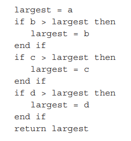
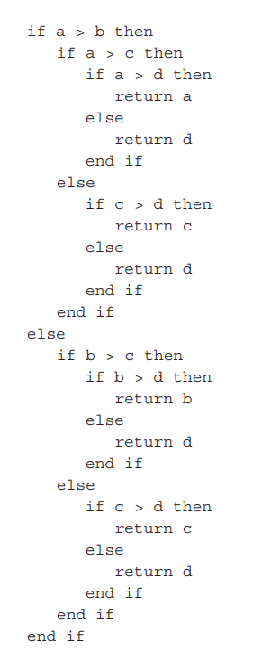

# 1 - 2 - რომელია უკეთესი ამ ორს შორის?

ამ შემთხვევაში პირველი უფრო კარგი გამოსაყნებელია. რატომ? განსვავებაა დროში/სიჩქარეში, თუ კომპიუტერის რა მეხსიერებას გამოიყენებს კონკრეტული კოდი/ალგორითმი. (windows-ზე task manager-ში შესაძლებელია ნახვა). აუცილებელია ავირჩიოთ რაიმე ოპერაცია და დავივალოთ ოპერაციების რაოდენობა. მაგ: მოცემულია 2 პროგრამა, ზომით განსხვავება, მაგრამ input, მისი რაოდენობა და შედეგი იგივეა. ორივეგან ვირჩევთ ერთი და იგივე ოპერაციას. შედეგი არის (მაგ) 4 რიცხვში უდიდესი. განხვავებაა თუ რამდენჯერ მოხდა შედარება (ოპერაციები), რომელიც გარკვეულ ფუნქციაში ხდება. `f(a, b, c, d)`, თან დავთვალოთ ოპერაციების რაოდენობა (რომელი რომელზე მეტია). ეს 4 რიცხვი შეიძლება იყოს `b < a < c < d`. 'დიდი ზომის' პროგრამა 3 ოპერაციას/შედარებას ასრულებს და ადგენს მაქსიმუმ შედეგს. ახლა განვიხილოთ მეორე, მცირე ზომის პროგრამა `g(a, b, c, b) = 3`, სადაც if else-ები არ არის და პირდაპირ ადგენს შედეგს. შესაძლოა ნახოტ ბევრი ვარიანტი, სადაც ამ 4 რიცსვის სიდიდე განსხვავდება, მაგრამ ყველა შემთხვევაში ოპერაციების რაოდენობა სულ 3 იქნება.